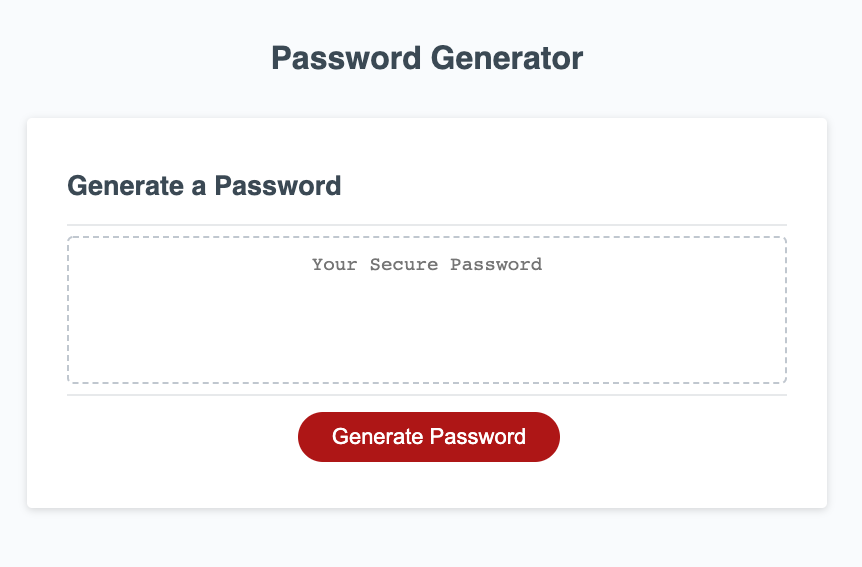

# homework-03-password-generator

## Description

The purpose of this application is to generate a random password for the user, accounting for the length and character styles set by the user.

### Application Functionality 
* Uses a passwordPrompt function that is called when the "Generate Password" button is clicked. Doing so will prompt the user to input how many characters the want and if they want lowercase letters, uppercase letters, numbers, and symbols.
* The resulting password is then displayed inside the box on the screen.

### Development Notes
* If the user sets the password length under 8 or over 128 characters, an alert is presented and the application stops.
* I used a function that creates an array of charCodes for all of the character types. I then created const variables for each of these character types, calling the function and passing the charCode ranges as arguments.
* The passwordGenerator function contains a set of If Statements. If the user selects "yes" for a particular character type, then that set of charcodes is added and concatenated to an array called charCodes.
* The passwordGenerator function uses a For Loop that randomizes a set of charcodes, and converts them into their specific characters. These are then added into a new array called passwordCharacters, and returned as a joined string.
* The resulting joined passwordCharacters string is then displayed on the page as the user's randomized password.

## Live Application

You can view the live application [here](https://mrpancakes.github.io/homework-03-password-generator/), along with the GitHub repo [here](https://github.com/mrpancakes/homework-03-password-generator).

